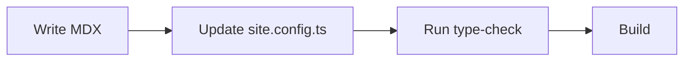

Use this page to inspect the starter's built-in MDX components. The examples use placeholder data so you can safely edit, copy, or delete them later.

## Badges and icons

Use badges inline when a short status helps readers scan.

<Badge>Default</Badge> <Badge color="blue" icon="sparkles">Beta</Badge> <Badge color="green" size="lg">Ready</Badge> <Badge color="yellow" shape="rounded">Needs review</Badge> <Badge color="red" stroke>Deprecated</Badge> <Badge disabled>Disabled</Badge>

Use the public icon component for inline visual labels: <Icon icon="rocket" label="Rocket" /> <Icon icon="settings-2" /> <Icon icon="wand-sparkles" color="#6d28d9" />.

## Callouts

<Note>
This is a neutral note for extra context.
</Note>

<Info>
This is an information callout with a helpful detail.
</Info>

<Tip>
This is a tip that suggests a better path.
</Tip>

<Check>
This is a success message after a completed setup step.
</Check>

<Warning>
This is a warning for actions that need care.
</Warning>

<Danger>
This is a danger callout for destructive or high-risk actions.
</Danger>

<Callout title="Custom callout" icon="sparkles" color="#6d28d9">
Use `Callout` when the preset names are not the right label for the message.
</Callout>

## Cards, tiles, and columns

<Columns columns="3">
  <Card title="Quickstart" icon="rocket" href="/getting-started" tag="Guide" cta="Start here">
    A linked card for a common first step.
  </Card>
  <Card title="Settings" icon="settings-2" href="/customize-site" tag="Config" color="#0f766e">
    A linked card for customization.
  </Card>
  <Card title="Plain card" icon="circle-help" tag="Note" arrow>
    A non-linked card can summarize a concept.
  </Card>
</Columns>

<Card title="Horizontal card" icon="layout-panel-left" img="/logo/docs-mark.svg" horizontal cta="Read the setup guide" href="/getting-started">
  Horizontal cards can pair a small image with a title, body copy, and call to action.
</Card>

<Columns columns="3">
  <Tile title="Writing guide" icon="file-text" href="/write-content" cta="Open guide">
    A compact linked tile for related pages.
  </Tile>
  <Tile title="Reference demo" icon="braces" href="/reference-demo">
    A smaller target for API-style examples.
  </Tile>
  <Tile title="Deployment" icon="cloud" href="/deploy-to-vercel">
    A tile can fit inside the same column grid.
  </Tile>
</Columns>

<Columns columns="2">
  <Column>
    ### Left column

    Put ordinary Markdown inside a `Column` when you want custom column content.
  </Column>
  <Column>
    ### Right column

    Columns stack on smaller screens.
  </Column>
</Columns>

## Steps

<Steps>
  <Step title="Create a page" icon="file-plus-2" id="create-a-page">
    Create or edit an `.mdx` page.
  </Step>
  <Step title="Add navigation" icon="list-plus">
    Add the page slug to `site.config.ts`.
  </Step>
  <Step title="Preview locally" icon="monitor-play" titleSize="lg">
    Run `npm run dev` and check the page locally.
  </Step>
</Steps>

## Accordions and expandable details

<AccordionGroup>
  <Accordion title="What should go in an accordion?" description="Use this for optional details." icon="circle-help" defaultOpen id="accordion-demo">
    Optional details, long explanations, or extra troubleshooting notes.
  </Accordion>
  <Accordion title="Can accordions contain Markdown?" icon="text">
    Yes. You can include **bold text**, links, lists, and code snippets.
  </Accordion>
</AccordionGroup>

<Expandable title="More sample details" icon="chevrons-up-down" defaultOpen>
This expandable block is useful for information that should not interrupt the main flow.

- It can include lists.
- It can include `inline code`.
- It can include links.
</Expandable>

## Tabs and code groups

<Tabs defaultTabIndex="1" sync borderBottom>
  <Tab title="npm" icon="package">
    ```bash title="Install with npm"
    npm install
    npm run dev
    ```
  </Tab>
  <Tab title="pnpm" icon="package-check">
    ```bash title="Install with pnpm"
    pnpm install
    pnpm dev
    ```
  </Tab>
  <Tab title="yarn" icon="package-plus">
    ```bash title="Install with yarn"
    yarn install
    yarn dev
    ```
  </Tab>
</Tabs>

<Tabs dropdown defaultTabIndex="2">
  <Tab title="Beginner">
    Use the default `site.config.ts` values and replace one page at a time.
  </Tab>
  <Tab title="Team">
    Add owners, review paths, and contribution notes that fit your docs process.
  </Tab>
  <Tab title="Reference">
    Use generated API pages when you already have OpenAPI or AsyncAPI files.
  </Tab>
</Tabs>

## Code blocks

```ts title="Highlighted config" lines {2,6} focus="2-7"
export const demoConfig = {
  name: "Demo Docs",
  theme: "system",
  features: {
    search: true,
    assistant: false,
  },
};
```

```diff title="Diff example" wrap
- oldTitle: "Untitled"
+ title: "Component gallery"
+ description: "Preview the built-in components."
```

```mdx title="Expandable code example" expandable
<Card title="Example" href="/getting-started">
  This code block is intentionally longer than the others so you can inspect the expandable styling. Add your own snippets here when you need a compact reference.
</Card>
```

<CodeGroup sync dropdown>
```bash title="Build"
npm run build
```

```bash title="Type check"
npm run type-check
```
</CodeGroup>



## Panels, banners, and updates

<Panel title="Demo panel">
Panels can frame a short concept, checklist, or grouped note. On wide screens, panel content also appears in the right rail.
</Panel>

<Banner title="Launch notice" icon="megaphone">
This banner uses placeholder launch copy. Replace it with a real project notice when needed.
</Banner>

<Update label="Starter update" description="Generated Markdown and component parity examples are available." tags="Docs, Demo" rss>
The starter includes generated Markdown pages, `llms.txt`, and a minimal MCP endpoint.
</Update>

## Frames and images

<Frame caption="Dummy frame using the starter logo mark." hint="Use `hint` for a short supporting note.">
  
</Frame>

## API-style fields

<ParamField path="projectId" type="string" required pre="path">
The unique ID for the example project.
</ParamField>

<ParamField query="includeDrafts" type="boolean" optional default="false">
Set this to `true` to include draft pages in a sample response.
</ParamField>

<ParamField header="Authorization" type="string" placeholder="Bearer token" required>
Send an access token with the example request.
</ParamField>

<ResponseField name="title" type="string" required>
The display title for the documentation page.
</ResponseField>

<ResponseField name="legacyId" type="string" deprecated>
The old identifier remains in sample data for migration examples.
</ResponseField>

<RequestExample title="Create page request">

```json title="Sample request"
{
  "projectId": "demo_123",
  "includeDrafts": false
}
```

</RequestExample>

<ResponseExample title="Create page response">

```json title="Sample response"
{
  "id": "page_getting_started",
  "title": "Getting started",
  "status": "ready"
}
```

</ResponseExample>

## Color, prompt, tooltip, tree, view, and visibility

<Color>
  <Color.Row>
    <Color.Item name="Ink" value="#1d1d1d">Primary text color.</Color.Item>
    <Color.Item name="Surface" value="#ffffff">Base page surface.</Color.Item>
    <Color.Item name="Accent" value="#0f766e">Example custom accent.</Color.Item>
  </Color.Row>
</Color>

<Prompt title="Docs prompt" description="Copy this prompt into your AI coding tool." cursor>
Write a concise release note for the latest documentation starter update.
</Prompt>

This sentence has a <Tooltip tip="This is helper text shown on hover or focus.">tooltip</Tooltip> in the middle.

<Tree>
  <Tree.Folder name="docs" defaultOpen>
    <Tree.File name="component-gallery.mdx" icon="file-text" />
    <Tree.File name="reference-demo.mdx" icon="file-check-2" />
  </Tree.Folder>
  <Tree.File name="site.config.ts" icon="settings-2" />
</Tree>

<View title="Writer">
Use this view for content authors who only need page and navigation files.
</View>
<View title="Developer">
Use this view for component, API route, and build-system work.
</View>

<Visibility for="humans">
This human-only note renders on the web page and is omitted from generated Markdown.
</Visibility>

<Visibility for="agents">
This agent-only note is hidden on the web page and included in generated Markdown.
</Visibility>

## Standard Markdown

| Type | Example |
| --- | --- |
| Inline code | `site.config.ts` |
| Link | [Deploy to Vercel](/deploy-to-vercel) |
| Strong text | **Important label** |

> This is a plain Markdown blockquote.

- [x] Task lists work through GitHub-flavored Markdown.
- [ ] Replace demo copy before publishing.

## Unsupported component fallback

<ExampleWidget status="demo">
This fake component demonstrates the fallback that appears when an unknown capitalized MDX component is used.
</ExampleWidget>

Next step: [Reference demo](/reference-demo)
